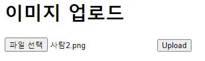
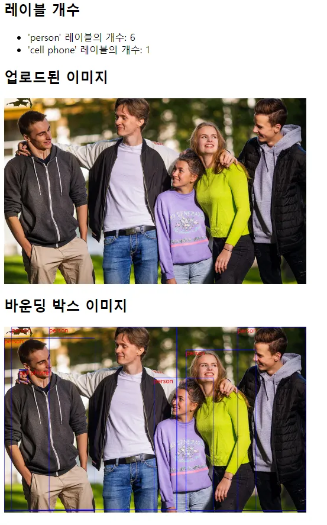
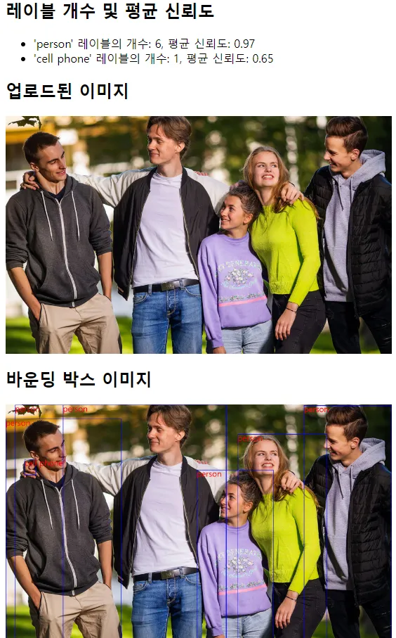

1. **어떤 문제를 해결하고싶은지 정의**
    
    - 주어진 이미지에 몇 명의 사람이 있는지 세어주기
    
2. **문제를 해결 할 수 있는 ai task 정리**
    
    - object-detection
    
3. **task 별 모델들을 가져와 적합한 모델찾기**
    1. facebook/detr-resnet-50
4. **모델을 이용한 fast api 서빙**

**** 이미지 업로드 페이지 ****

    

**** 결과 화면 1 ****

**** 결과 화면 2 (평균 신뢰도 추가)****

